# Calendar-Skill
Chatbot with calendar functionalities to arrange meetings through chat using my google agendas.

## Steps to built this awsome chatbot

1) clone microsoft repository --> https://github.com/microsoft/botframework-solutions/tree/master/skills/csharp/calendarskill
2) Run the following command in calendarskill folder

```
./Deployment/Scripts/deploy.ps1
```

Don't forget to run this command inside CLI, a not in the normal terminal. I'm a Mac user :)

3) Wait a long time... This is a boring process :/

This is what you will after running the command

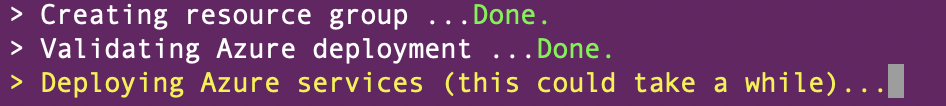</img>

4) Now you should see a resource group in your azure accoount, and several application inside of it. Great! If you are not seeing none of that, you should try the step above.

5) Let's look at our code. It is possible to see that the script has updated several files in our program. Specially, the appsetting.json. To test the bot follow these steps
- open the Bot Framework Emulator --> click on "Open Bot"
- choose the localhost your bot is running. Example: http://localhost:1205/api/messages
- copy the Microsoft App Id from the appsetting.json
- copy the Microsoft App password from the appsetting.json
- finally, hit connect!

what should you see? Probably it did not work


*Very important detail!*

When you try to run the bot, it won't work because you need to provide some information in azure. So, DON'T FORGET TO FOLLOW THE STEPS FROM THIS TWO PAGES, or the bot will not work. Sorry for the capslock :)

https://microsoft.github.io/botframework-solutions/skills/samples/calendar/

https://microsoft.github.io/botframework-solutions/skills/handbook/authentication/#manual-authentication-steps

## Images to understand more about this chatbot

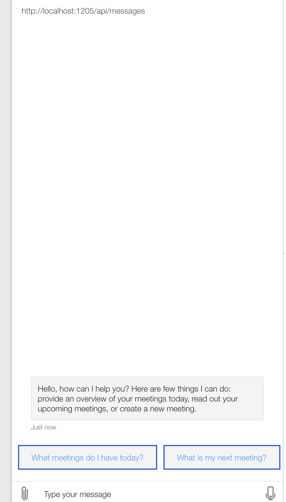</img>

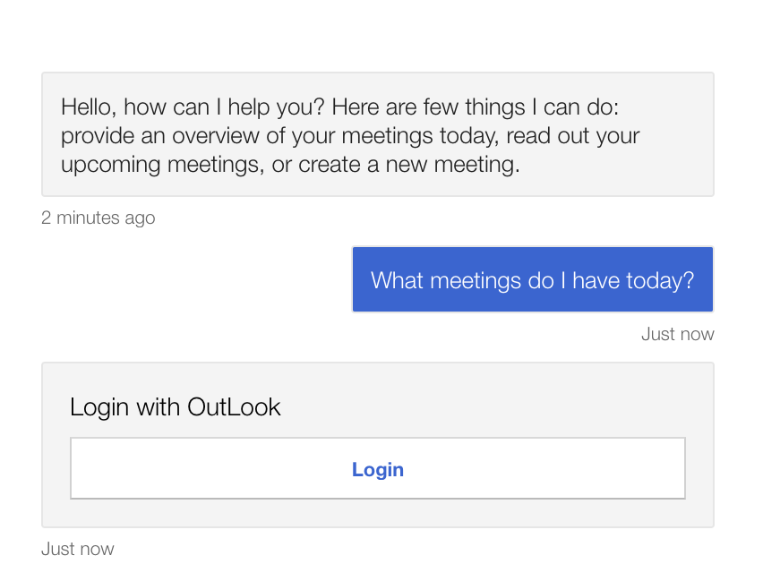</img>

If you click login probably it will not work. Remember to mark 'Use a sign-in verication code for OAuthCards' in the Bot Framework Emulator  User settings.

After I clicked on the Login button the following page will open.
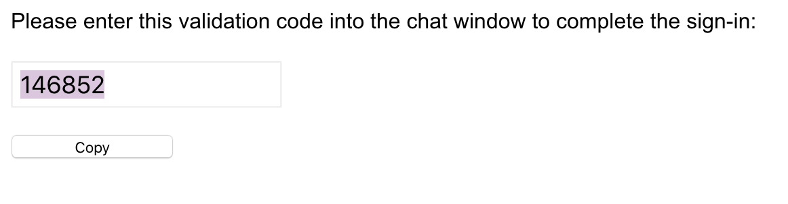</img>

You just need to copy and paste this code to the chatbot and the bot will continue with the chat successfully. 

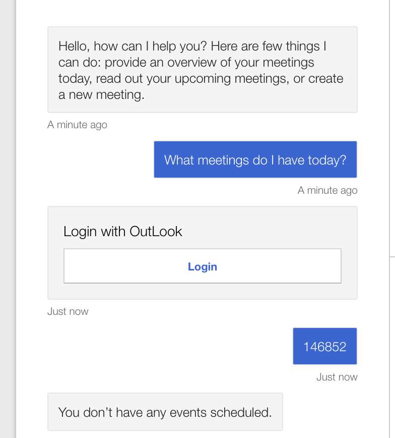</img>

As we can see, I haven't schedule any events. The following images show how you can schedule any meeting, invite people for it and set the location.

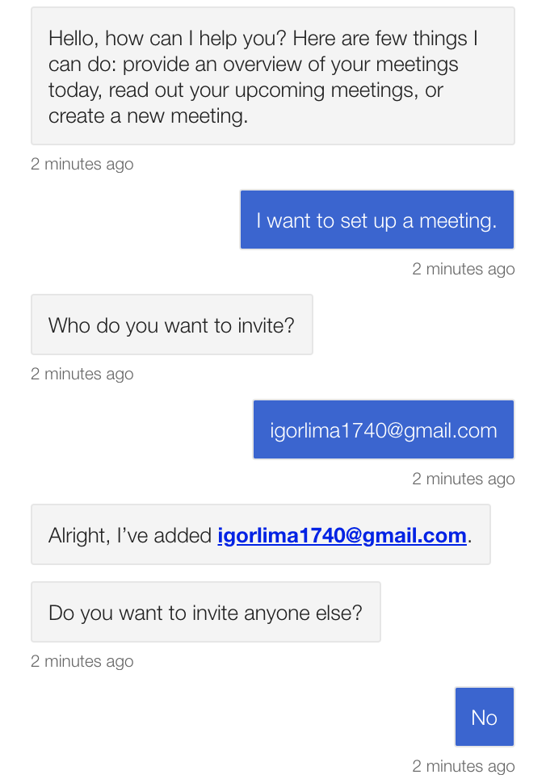</img>
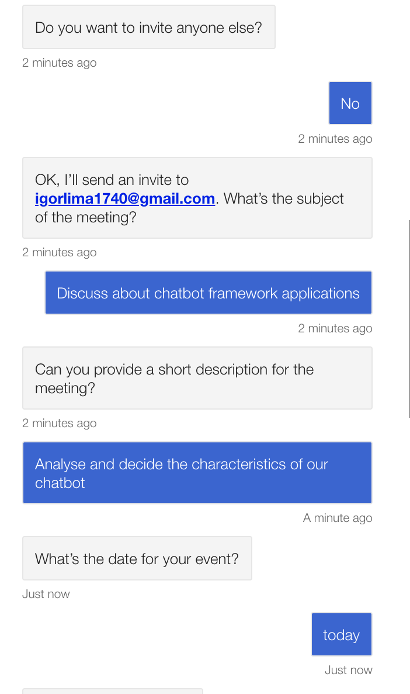</img>
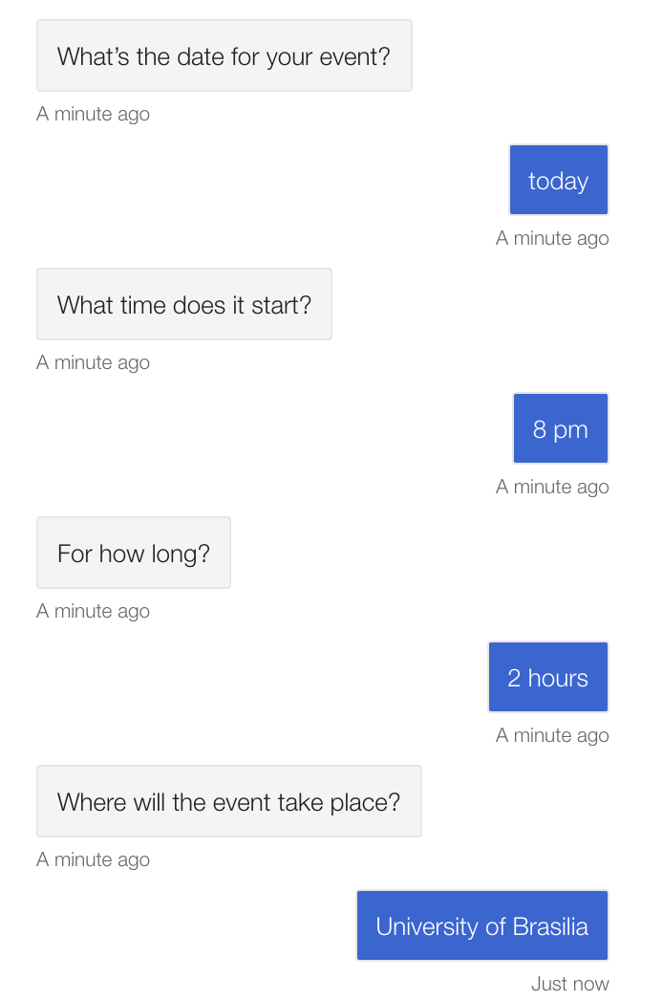</img>
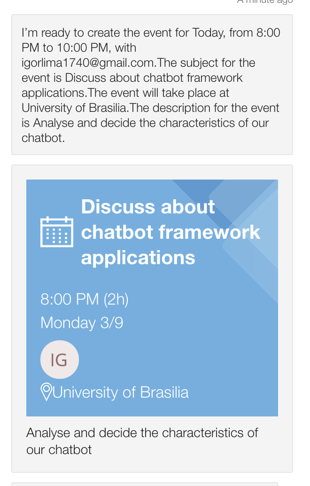</img>

The picture below shows the meeting request received in my email igorlima1740@gmail.com sent by the chatbot.

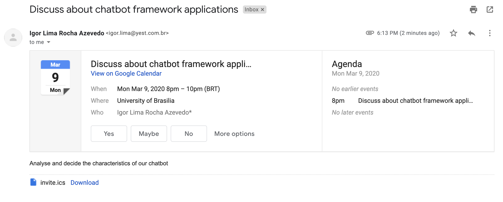</img>

As we can see, the meeting has been added in my Outlook agends

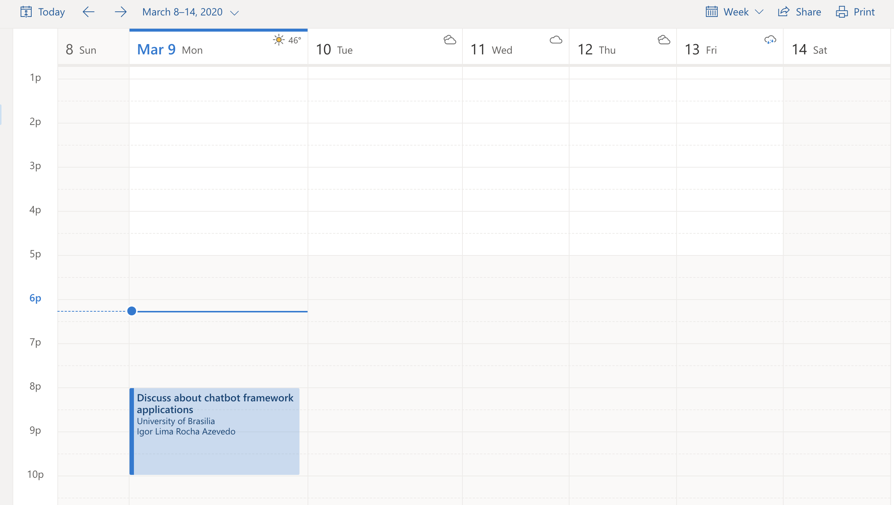</img>

After I accept the meeting, I can ask for the chatbot what meetings do I have next.

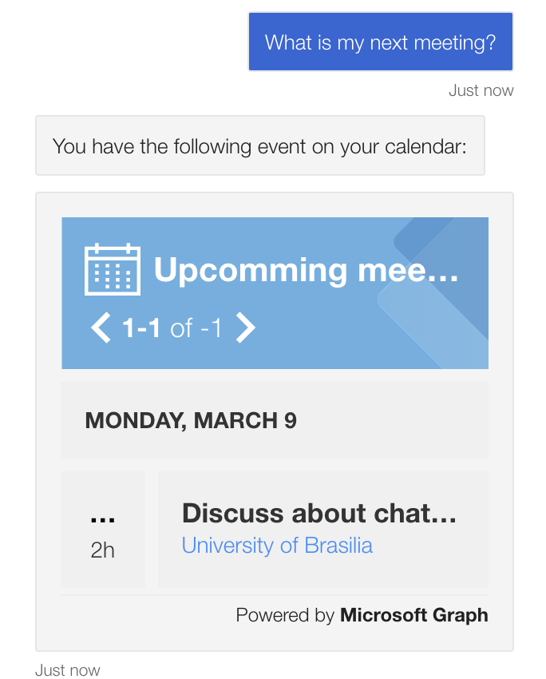</img>

## Why this chatbot is useful?

With a calendar chatbot is possible to arrange a meeting or an event through a chat! Yes, I know. You are probably asking "Why don't you just schedule the meeting in the google agenda app? Dur." Usually people prefer to talk with a chat  than actually using  apps, that's why chatbots are so famous nowadays. 


## I hope this mini tutorial helped you understand more about calendar skills :)